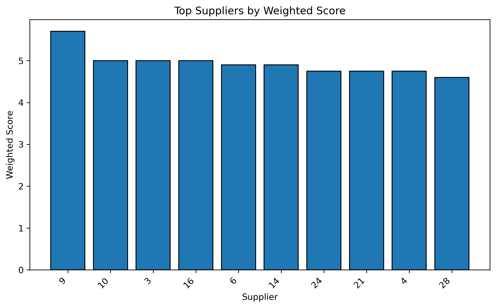
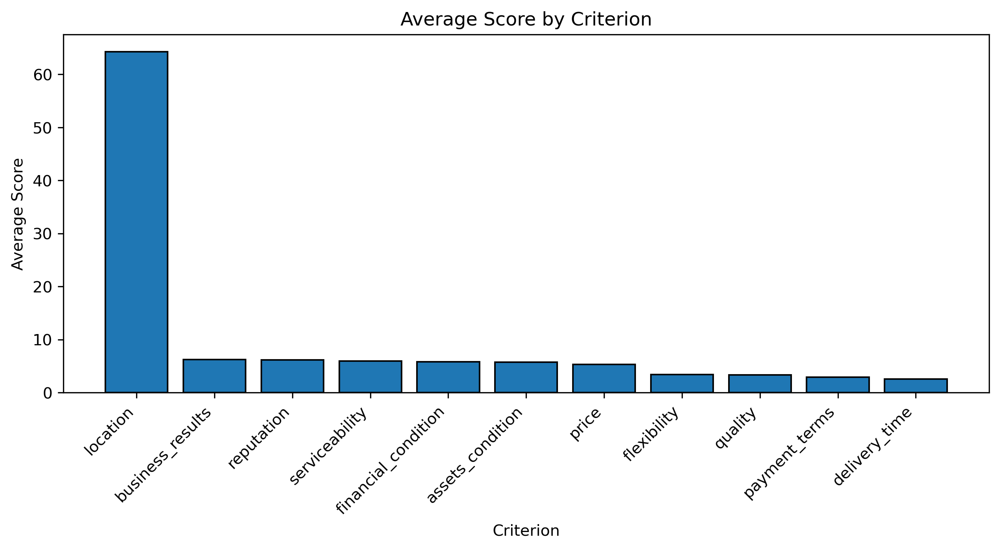
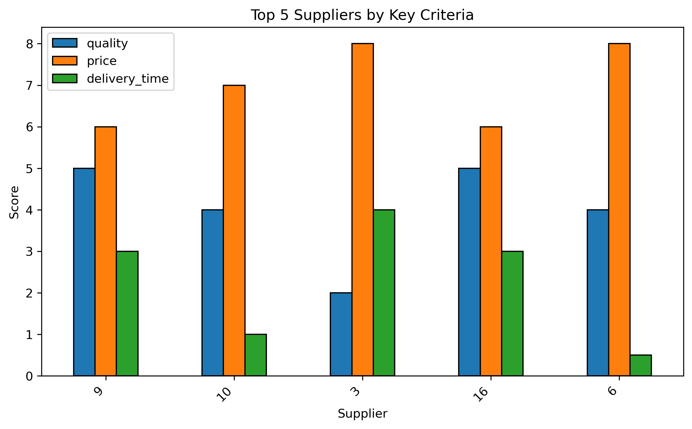

# Supplier-Evaluation-and-Ranking-for-Procurement-Decision
##  Objective
This project evaluates and ranks suppliers based on multiple procurement-related criteria, including quality, price, delivery time, flexibility, serviceability, and financial condition.

The objective is to support procurement decision-making with a more balanced evaluation approach, instead of relying on a single factor such as price.

##Context
In real supply chain operations, supplier selection affects delivery reliability, service continuity, procurement efficiency, and operational risk. A supplier that performs well in one dimension only may still create problems if delivery, flexibility, or financial stability are weak.

This project applies a weighted scoring approach to compare suppliers more systematically and support better sourcing decisions.

## Method
A weighted supplier score was calculated by assigning higher importance to key procurement criteria such as:
- quality
- price
- delivery time

Supporting criteria such as flexibility, serviceability, and financial condition were also included to reflect a more realistic supplier evaluation process.

## Key Insights Based on Visual Outputs

### 1. Top Suppliers by Weighted Score
The **Top Suppliers by Weighted Score** chart shows that the highest-ranked suppliers are not selected because of one isolated strength only. Instead, they appear to perform relatively well across several important dimensions.

**Supply chain implication:**  
This reflects a practical procurement reality: the most suitable suppliers are often those that provide a balanced combination of quality, delivery capability, and overall business reliability, rather than those that only compete on one attribute.

---

### 2. Average Score by Criterion
The **Average Score by Criterion** chart helps identify which evaluation dimensions are generally stronger or weaker across the supplier base.

If some criteria have noticeably lower average scores than others, this suggests that these dimensions may represent broader supplier capability gaps.

**Supply chain implication:**  
For procurement teams, this kind of view helps identify where supplier development or stricter supplier screening may be needed. For example, if delivery-related or service-related criteria are weaker on average, this may indicate future risk in responsiveness, order fulfillment, or supply continuity.

---

### 3. Top 5 Suppliers by Key Criteria
The **Top 5 Suppliers by Key Criteria** chart compares top-ranked suppliers across quality, price, and delivery time.

This comparison shows that even among stronger suppliers, performance may differ across key procurement priorities. One supplier may score well on quality but only moderately on delivery time, while another may be more balanced overall.

**Supply chain implication:**  
This is highly relevant in practice because procurement decisions often depend on business priority. If the goal is cost efficiency, one supplier may appear attractive. If the goal is service reliability or delivery consistency, another supplier may be more suitable. The chart supports trade-off-based decision-making instead of one-dimensional selection.

## Business Relevance
This project is relevant to procurement and supply chain roles because it demonstrates how supplier evaluation can be translated into a structured decision support tool.

Rather than selecting suppliers based only on price, the analysis supports a more realistic sourcing perspective by considering multiple performance dimensions that affect operational reliability.

## Files
- `supplier_ranking_grades.xlsx` – source dataset
- `suppliers_ranking_grades.py` or `suppliers_ranking_grades.ipynb` – Python analysis file
- `top_suppliers_weighted_score.png` – supplier ranking chart
- `average_score_by_criterion.png` – criterion-level summary chart
- `top5_suppliers_key_criteria.png` – top supplier comparison chart

## Tools Used
- Python
- Pandas
- Matplotlib
